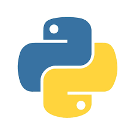

# 📘 Guia Completo de Python

Seja bem-vindo ao meu mundo de **Python**! 🐍  
Este repositório foi criado com fins **educacionais**, aberto para quem quiser **estudar, revisar ou contribuir**.

---

## 🎯 Objetivo
Construir uma **base sólida na linguagem Python**, com explicações claras e **exercícios práticos**, indo do nível iniciante até conceitos mais avançados.

---

## 🛠 Tecnologias
- **Python**

---

## ⚙️ Estrutura do Projeto
- [x] **Mundo 1** – Variáveis e condições básicas  
- [ ] **Mundo 2** – Condições avançadas e estruturas de repetição  
- [ ] **Mundo 3** – Tuplas, listas, dicionários e estruturas compostas  
- [ ] **Mundo 4** – Programação Orientada a Objetos (POO) em Python  

---

## ▶️ Como executar
1. O projeto é dividido em **Mundos**
2. Cada Mundo contém:
   - Aulas explicativas
   - Pastas com **desafios práticos**

---

## 📸 Logo

---

## 📌 Status
🚧 **Em desenvolvimento**
